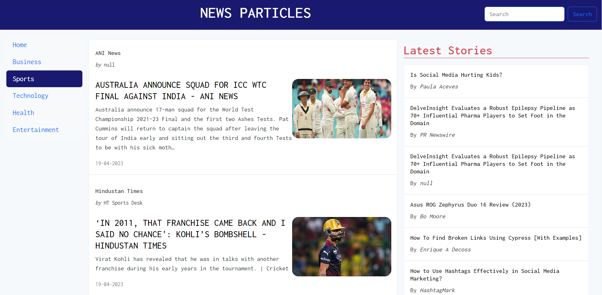

<!-- PROJECT LOGO -->
 

  

  <h3 align="center">News Particles</h3>

  

    A News website shows results based on NewsAPI.
  

<!-- ABOUT THE PROJECT -->

## About The Project

News Particles is a news website that shows results based on NewsAPI. All the news can be categorised based on sports, business, markets, and politics. We can search for specific news based on a topic using the search bar. We can read news that is shown on a website from its own source.

